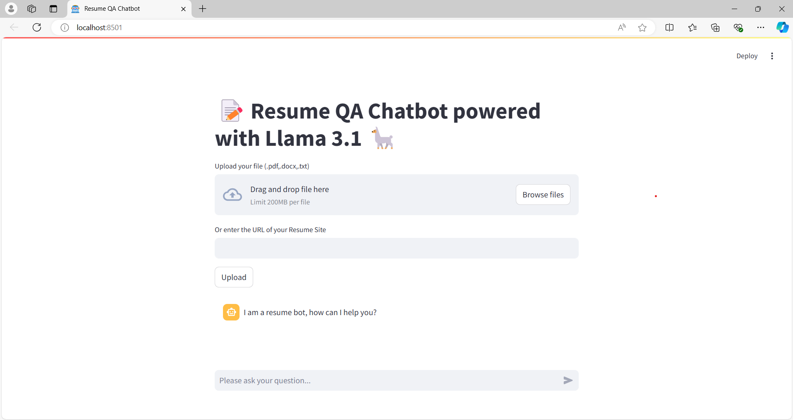
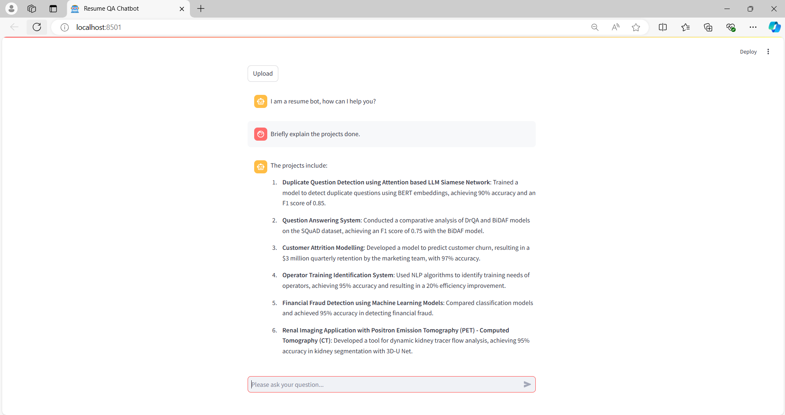
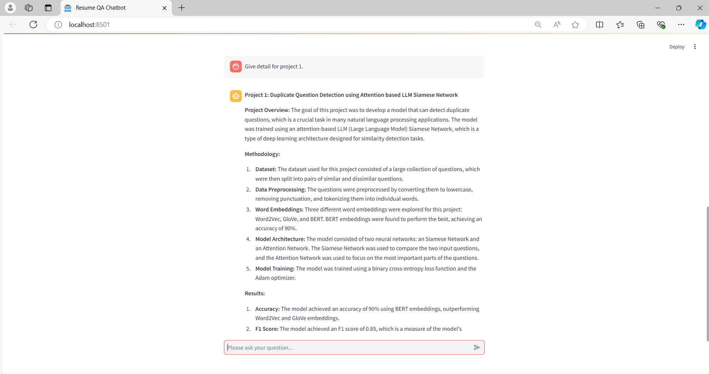

# 📝 Resume QA Chatbot powered with Llama 3.1 🦙

This is a Streamlit-based application that allows users to upload their resumes or provide a URL for their resume, and ask questions related to the content. The application utilizes Langchain's document processing and HuggingFace embeddings to create a vector store and powers the question-answering mechanism with a Retrieval-Augmented Generation (RAG) chain.

## Table of Contents
- [Features](#features)
- [Installation](#installation)
- [Usage](#usage)
- [Project Structure](#project-structure)
- [License](#license)

---

## Features

- 📄 Upload resumes in `.pdf`, `.docx`, or `.txt` formats.
- 🌐 Input URLs to load resumes from websites.
- 🤖 Conversational chatbot to ask questions about the resume content.
- 🧠 Powered by Langchain, FAISS, and HuggingFace embeddings.
- 🔍 Retrieval-Augmented Generation (RAG) based question answering.
- 🦙 Utilising the potential of Llama 3.1 to generate answers.

---

## Installation

### Prerequisites

Make sure you have `python3` installed. You can install the dependencies using the following steps:

1. Clone the repository:

    ```bash
    git clone https://github.com/VKaushik24/ResumeQAbot.git
    cd resume_qa_bot
    ```

2. Create and activate a virtual environment:

    ```bash
    python3 -m venv venv
    source venv/bin/activate  # On Windows: venv\Scripts\activate
    ```

3. Install the dependencies:

    ```bash
    pip install -r requirements.txt
    ```

4. **Set up Environment Variables:**
   
   Add your **GROQ API Key** in the `.env` file or directly in the `config.py` file:

   ```bash
   echo "GROQ_API_KEY=your_api_key_here" > .env

5. **Use Streamlit to run the app:**

    ```bash
    streamlit run main.py
    ```
## Application interface

### Main Interface:
Users can upload their resumes in various formats (PDF, DOCX, TXT) or provide a link to their website.


### Question Answering:
Once the resume is uploaded, users can ask questions, and the chatbot will provide answers based on the information from the uploaded file.


### Follow-up Questions:
It handles follow-up questions by maintaining the context of the conversation to provide coherent and contextually appropriate responses.
