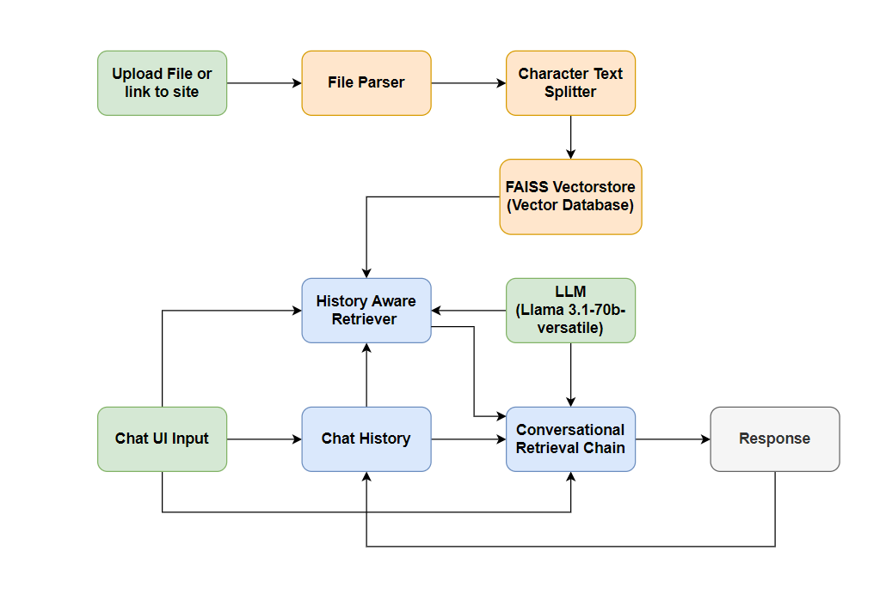

# 📝 Resume QA Chatbot powered with Llama 3.1 🦙

This is a Streamlit-based application that allows users to upload their resumes or provide a URL for their resume, and ask questions related to the content. The application utilizes Langchain's document processing and HuggingFace embeddings to create a vector store and powers the question-answering mechanism with a Retrieval-Augmented Generation (RAG) chain.

## Table of Contents
- [Features](#features)
- [Installation](#installation)
- [Usage](#usage)
- [Application Interface](#application-interface)
- [System Architecture](#system-architecture)
- [Evaluation criterion](#evaluation-criterion)
- [Project Structure](#project-structure)
- [License](#license)

---

## Features

- 📄 Upload resumes in `.pdf`, `.docx`, or `.txt` formats.
- 🌐 Input URLs to load resumes from websites.
- 🤖 Conversational chatbot to ask questions about the resume content.
- 🧠 Powered by Langchain, FAISS, and HuggingFace embeddings.
- 🔍 Retrieval-Augmented Generation (RAG) based question answering.
- 🦙 Utilising the potential of Llama 3.1 to generate answers.

---

## Installation

### Prerequisites

Make sure you have `python3` installed. You can install the dependencies using the following steps:

1. Clone the repository:

    ```bash
    git clone https://github.com/VKaushik24/ResumeQAbot.git
    cd resume_qa_bot
    ```

2. Create and activate a virtual environment:

    ```bash
    python3 -m venv venv
    source venv/bin/activate  # On Windows: venv\Scripts\activate
    ```

3. Install the dependencies:

    ```bash
    pip install -r requirements.txt
    ```

4. **Set up Environment Variables:**
   
   Add your **GROQ API Key** in the `.env` file or directly in the `config.py` file:

   ```bash
   echo "GROQ_API_KEY=your_api_key_here" > .env

5. **Use Streamlit to run the app:**

    ```bash
    streamlit run main.py
    ```

## Usage
### 1. Upload your Resume:  
Once you run the Streamlit application, you will be prompted to upload your resume (in .pdf, .docx, or .txt format) or provide the URL of your resume site.

### 2. Interact with the Chatbot:
After uploading your resume or providing a URL, you can ask questions related to the content of your resume. The chatbot will respond based on the document you uploaded


## Application Interface

### Main Interface:
Users can upload their resumes in various formats (PDF, DOCX, TXT) or provide a link to their website.


### Question Answering:
Once the resume is uploaded, users can ask questions, and the chatbot will provide answers based on the information from the uploaded file.


### Follow-up Questions:
It handles follow-up questions by maintaining the context of the conversation to provide coherent and contextually appropriate responses.


## System Architecture

The basic components involved in the application is given below:

### 1. Document Loading & Preprocessing for Data Ingestion
- **TextLoader, WebBaseLoader,Docx2txtLoader & PyPDFLoader**  loads and parses resume from different sources. It gives user the ability to ingest data via files or a website.
- **CharacterTextSplitter** splits the content into manageable chunks for vectorization.

### 2. Embedding & Vector Store (FAISS)
- **HuggingFace Embeddings** are used to convert document chunks into vectors.
- **FAISS** stores these vectors for efficient similarity search. This is the basic component that helps in providing **RAG(Retrieval-Augmented Generation)** capability to the application.

### 3. LLM - Llama 3.1-70b-versatile
- The conversational model used is **Llama 3.1-70b-versatile**, provided via the **ChatGroq** API.
- The model parameters (e.g., temperature, max tokens) are provided for optimal conversational engagement.

### 4. History-aware Retriever
- Combines document embeddings and conversation history to enhance query accuracy.
- Built using `create_history_aware_retriever` to integrate past conversations and document context.

### 5. Conversational Chain
- The final **Conversational Retrieval Chain** is created using `create_retrieval_chain`, which provides document-aware responses.

### Architecture Diagram:
The architectural diagram is shown below where diffecent components are combined together to provide context and history aware responses.



## Evaluation criterion:
The most important aspect for evaluating the application is the ability to provide contextual responses for the query asked. The other Evaluation Methods are:
### 1. Functional Evaluation

##### a. **Document Parsing and Loading**
   - **Objective**: Ensure that PDF documents are correctly uploaded, parsed, and chunked for processing.
   - **Success Criteria**: 
     - PDF content should be correctly loaded.
     - Document chunks should be accurately split with the desired chunk size and overlap.

##### b. **Response Accuracy**
   - **Objective**: Validate that the responses generated by the system are relevant and accurate based on the content of the uploaded PDF.
   - **Test Method**: Submit various queries related to the content of the uploaded PDF and evaluate the responses for correctness.
   - **Metrics**:
     - Precision/Recall for document-based query responses.
     - Human-evaluated correctness for conversational responses.
   - **Success Criteria**: A high rate of relevant and accurate answers from the document content.

### 2. Usability and User Experience (UX)

#### a. **Ease of Use**
   - **Objective**: Ensure that the application is easy for users to interact with, including uploading PDFs and asking questions.
   - **Test Method**: Perform user testing where participants upload PDFs, ask questions, and interact with the chatbot.
   - **Success Criteria**: 
     - Users should be able to easily navigate the app and understand how to upload documents and interact with the chatbot.
#### b. **Conversational Flow**
   - **Objective**: Ensure that the conversation flow feels natural and context-aware.
   - **Test Method**: Evaluate conversation quality with users, ensuring that the bot maintains context throughout the session.
   - **Metrics**:
     - Chat history accuracy and relevance.
     - User satisfaction score for conversational flow.
   - **Success Criteria**: Users should report a seamless, context-aware interaction experience.

### 3. Performance Testing

#### a. **Latency**
   - **Objective**: Measure how quickly the system processes user queries and provides responses.
   - **Test Method**: Track the time from when the user submits a query to when a response is generated.
   - **Metrics**:
     - Average response time (in seconds) for different query complexities.
   - **Success Criteria**: Response time should be under a few seconds for typical queries.

## Project Structure
```bash
    resumeQAbot/
    │
    ├── main.py                     # Entry point for the Streamlit app
    ├── requirements.txt            # Python dependencies for the project
    ├── README.md                   # Project documentation
    ├── Utils/
        ├── document_loader.py      # Contains functions to load documents
        ├── vector_store.py         # Contains functions to set up FAISS vector store 
        ├── rag_chain.py            # Contains functions to create the RAG chain
        ├── chatbot.py              # Contains chatbot-related logic (chat history, user interaction etc)
        └── config.py               # Contains environment variables (e.g., API keys)
    
```
### Detailed Explanation:
* ```main.py```: This is the main entry point for the Streamlit app. It orchestrates the interaction between the user, document processing, and chatbot responses.

* ```document_loader.py```: This module handles the loading of documents, either from uploaded files (PDF, DOCX, TXT) or from web URLs.

* ```vector_store.py```: This module is responsible for setting up FAISS vector stores using HuggingFace embeddings, allowing the bot to retrieve relevant information from the uploaded resumes.

* ```rag_chain.py```: This handles the creation of a RAG (Retrieval-Augmented Generation) chain, which powers the question-answering system.

* ```chatbot.py```: Contains the logic for handling user interactions, including chat history and generating AI responses to user questions.

* ```config.py```: Stores environment variables such as the API key.

## License
This project is licensed under the [MIT License](https://opensource.org/license/mit). You are free to use, modify, and distribute this project as long as proper credit is given.

